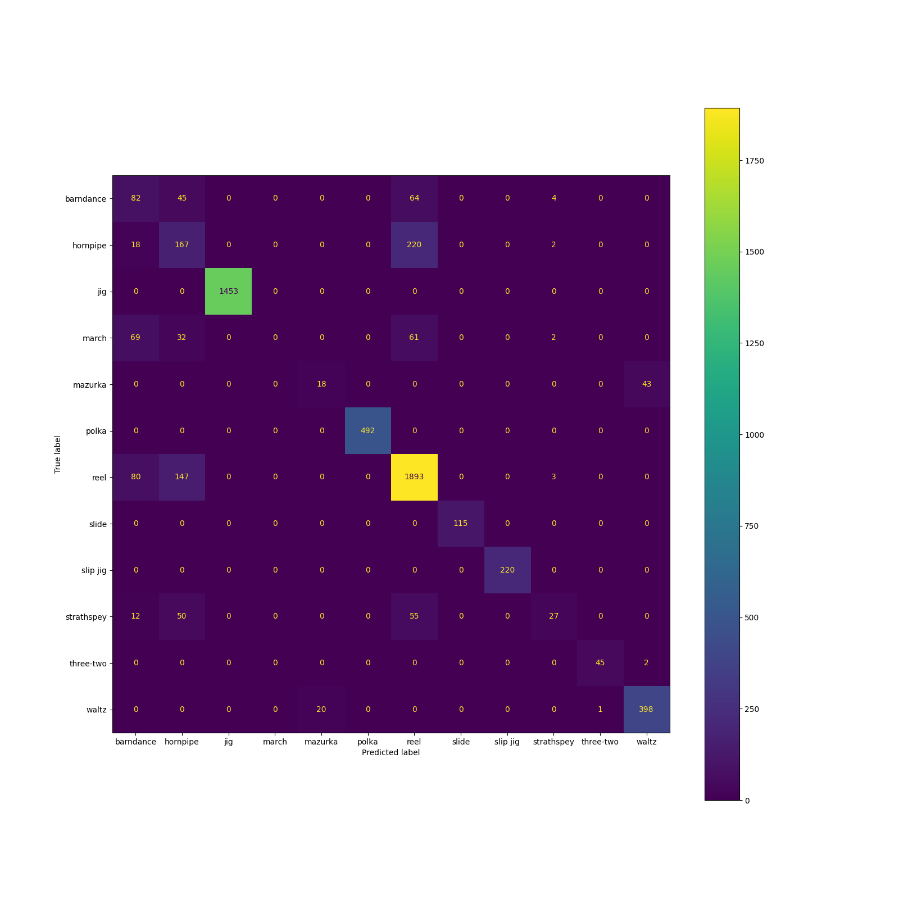

# Python script to classify Irish folk music from its initial rhythms

## Background

Since much Irish folk music is dance-based, it seems plausible that a
machine learning model could be trained to classify it solely from its
rhythms. For this, I analyzed a set of 45,914 Irish folk music tunes
transcribed in [abc notation](https://abcnotation.com/) from the website
[The Session](https://thesession.org/api) (downloaded on October 3,
2023). What I found was that it is a simple task for a computer to learn
to classify Irish folk music solely from the rhythms — almost! There are
some interesting caveats.

## Preprocessing

The code I used for this analysis is in the file `main.py`. The data
file is not included in this repository but needs to be downloaded from
[The Session](https://thesession.org/api) and put in the same directory
as `main.py` with file name `tunes.csv`, or whatever filename you
specify in the `raw_data_file` variable toward the top of the script.

To process the abc notation, I used the `music21` library for Python to
extract the rhythmic durations of all the notes, and I padded or
truncated the tunes so that the note durations were encoded as
128-dimensional feature vectors. That is, only the first 128 notes were
considered, and for tunes shorter than that, the vectors were zero
padded at the end.

For each tune, I also had the classification used by [The
Session](https://thesession.org/api), which was one of the following
types: reel, jig, polka, waltz, hornpipe, slip jig, barndance, march,
Strathspey, slide, mazurka, or three-two. Each of these was one-hot
encoded to produce the targets.

## Training models

I split off 15% of the data as a test set, and of the remaining 85%, I
split 15% off as a validation set used the rest of the data for
training.

After trying out some simple baseline models, I quickly noticed that
without the time signature, the note durations were not enough. In
retrospect, this makes complete sense: for example, some pieces might
consist mostly of long sequences of eighth notes. Without knowing
whether these eighth notes are in 3/4 or 4/4, it would be impossible to
tell the difference between the two time signatures. Even the beginnings
(which could have pick-up notes) or endings (which might have been
truncated) would be of no help. So I included the numerator and
denominator of the time signature as additional features for the model
to work with.

After further experimentation, I eventually settled on a neural network
model with three GRUs followed by two densely connected layers. As the
following confusion matrix shows, even such a small model was very
successful at predicting the genre of tunes in the validation set except
for one type: reels.

Even this simple model made almost no errors, except when classifying
reels. Some reels were incorrectly classified as another type, and some
other types were incorrectly classified as reels. This led me to
investigate further: why the confusion? Eventually I can to realize that
even human beings don’t agree on exactly what is or is not a reel. For
example, in a [discussion forum on The
Session](https://thesession.org/tunes/7033) of “The Reel of Tulloch”,
which (in spite of its name) [The Session](https://thesession.org/api)
classifies as a Strathspey, one writer posts:

> Having said that, “Reel of Tulloch” is to me a reel, not a Strathspey,
> although the Athole Collection does “dot it” liberally.

Further complicating the issue, another writer posted:

> As Nigel says, but also, there can be the tendency to not transcribe
> ‘snaps’, leaving them up to the discretion of the musician.

That is, certain features that might be used to distinguish a reel from
a Strathspey are often not transcribed. In that case, the computer
wouldn’t have access to them from the abc notation, so even if human
beings could agree on which was which, the computer would be missing an
important piece of information needed to distinguish the two. Further
discussion on the same thread seems only to muddy the waters.

## Conclusions

Some interesting things that came out of these investigations:

1.  Note durations aren’t enough to classify Irish folk music. The time
    signature is also needed.
2.  With the time signature, the note durations from the beginning of
    the tune do enable the computer to classify the tune type with a
    high degree of accuracy for all the tune types except reels. It
    would be interesting to explore exactly how few note durations are
    needed. That would be rather like a game of “Name That Tune” for the
    computer (or at least “Name That Tune Type”), using only rhythms.
3.  Reels are problematic for the computer to classify because even
    humans don’t agree on which tunes are reels and which aren’t.
    Further complicating the task is that some of the clues that humans
    might use to try to classify reels are not always included in the
    transcriptions.

Because the fitted model’s performance was so good on everything besides
reels and because of the difficulty that reels posed, it wasn’t worth
exploring any further models. Machine learning has an easy time
classifying all the types except reels. Even the simple model that I
used worked very well for the task. It could easily be fine-tuned if
need be, but it isn’t worth making the models more complicated to try to
improve the performance on reels. For reels, there isn’t even an
agreed-upon “right” answer, and even if there were, some of the relevant
information isn’t always contained in the transcriptions. And these are
interesting things to have learned!
